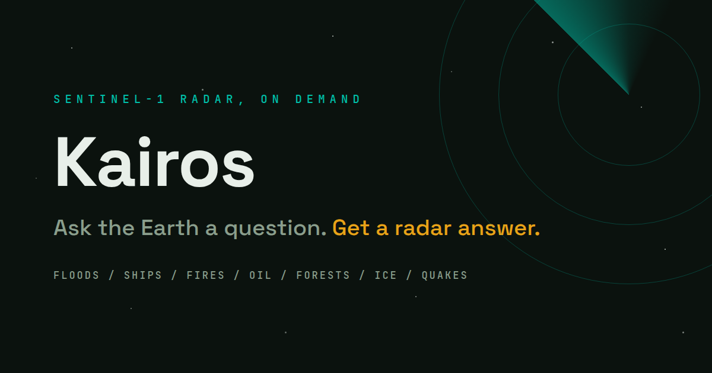
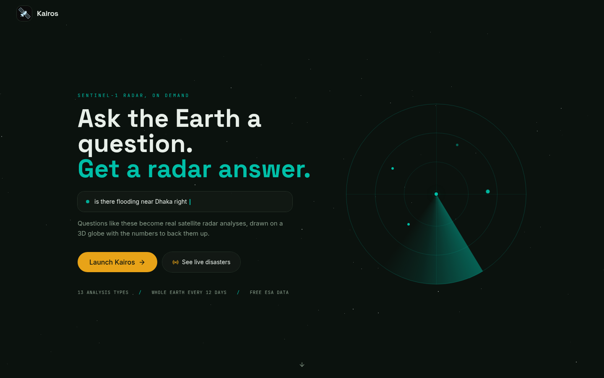

<p align="center">
  
</p>

# Kairos

Ask the Earth a question in plain language. Kairos runs a real satellite radar analysis and draws the answer on a 3D globe.

Type "is there flooding near Dhaka right now?" and about thirty seconds later you are looking at the actual flood extent, measured from space this week, with the area in km², a confidence score, and a plain explanation of what the radar saw.

## Why this exists

When a flood or a wildfire is happening, the satellites most people know about (the ones that take pictures) are usually blind, because floods come with storms and fires come with smoke. Radar satellites don't have that problem. The European Space Agency's Sentinel-1 mission images the entire planet every 12 days with synthetic aperture radar, straight through clouds and in total darkness, and the data is free for anyone.

Almost nobody uses it. The data comes as gigabyte-sized files that need specialist software and a remote sensing course to interpret. We started Kairos after watching news coverage of the Texas Hill Country floods, when it took days to know how far the water had actually spread. The measurement existed the whole time, sitting in a public archive. It was just unreadable to normal people. Kairos is our attempt at fixing the unreadable part.

## What it does

- **Ask in plain language.** A chat bar on the globe. Claude reads your question, figures out the analysis type, the place and the dates, runs it, and explains the result. Follow-ups work ("what about last year?", "now show ships there"), and one question can trigger multiple analyses at once ("show flooding and building damage in Kathmandu").
- **Thirteen analysis types.** Flood extent, flood depth, ship detection, wildfire burn scars, oil spills, deforestation, sea ice, surface deformation, earthquake building damage, land subsidence, urban growth, crop health, and illegal mining indicators. Each one reads a different radar signature.
- **A guided wizard** for full control: pick a task, draw an area (rectangle, free-hand polygon with live area and perimeter, or a pin), set dates, preview data availability, run, and read the result.
- **Research tools** on every result: the raw grayscale radar backscatter behind the detection, a Sentinel-2 optical comparison so you can see exactly why radar matters under cloud, a before/after cross-fade, a time-series scrubber, a population density overlay, and an estimate of people and buildings inside the detection footprint.
- **Live Watch**: a public dashboard of active disasters worldwide (from NASA EONET), one click from a real radar analysis of any of them.
- **Guardian**: a citizen-science mode where anyone can scan protected areas for signs of illegal mining and clearing, and vet what the radar flags.
- **Share and embed.** Any result becomes a reproducible link that reruns the exact same analysis for whoever opens it, no login needed. Results also export as GeoTIFF and as a methodology report.
- **Accounts are optional.** Signed-in users get saved analyses and alerts on new satellite passes over watched areas (Firebase + Firestore). Everything else works logged out.
- **Installable app.** Kairos is a progressive web app: install it from the browser and it opens standalone with its own icon, with the app shell cached for instant loads.

<p align="center">
  
</p>

## How a question becomes a map

1. The frontend sends your question, plus the current viewport and recent chat turns, to the FastAPI backend.
2. Claude (via OpenRouter) converts it into structured parameters: analysis type, bounding box, date window. If the question is ambiguous it asks you one clarifying question instead of guessing.
3. The backend builds an Earth Engine computation for that analysis: filter the Sentinel-1 archive to the area and dates, calibrate, compare against a baseline period, isolate the change signal. All of it runs server-side on Google's infrastructure. Raw imagery is never downloaded, which is the only reason a free student project can process petabyte-scale data.
4. Earth Engine returns a tile URL and statistics. The frontend adds the tiles to the Mapbox globe as a colored layer, and Claude writes the explanation you read in chat.

The physics, in one paragraph: the satellite pings the ground with microwaves and records how much energy bounces back (backscatter). Smooth water reflects the pulse away like a mirror, so new flooding shows up as land that suddenly went radar-dark. Buildings and ship hulls bounce energy straight back, so they are bright. Every analysis in Kairos is a different way of asking what changed in that echo.

## Stack

| Piece | What it actually does here |
|---|---|
| Google Earth Engine | Runs every satellite computation server-side against the Sentinel-1 archive |
| Sentinel-1 (ESA Copernicus) | The radar data itself, free and global, 12-day revisit |
| FastAPI (Python 3.11) | The API: analysis endpoints, scene search, exports, impact stats |
| Claude via OpenRouter | Turns questions into analysis parameters and results into plain English |
| React 18 + TypeScript + Vite | The frontend |
| Mapbox GL JS | The 3D globe and every layer drawn on it |
| Zustand | App state (map, wizard, chat, auth) |
| Tailwind CSS + Framer Motion | Styling and motion |
| Firebase Auth + Firestore | Optional accounts, saved analyses, satellite-pass alerts |
| Vercel + Railway | Hosting for the frontend and the backend |

There is no database requirement to run it, no GPU, and no local satellite data. The heaviest thing on your machine is node_modules.

## Run it locally

You need Python 3.11+, Node 20+, a free [Google Earth Engine registration](https://earthengine.google.com/) tied to a Google Cloud project, a free Mapbox token, and (only for the AI chat) an OpenRouter key. Windows works best under WSL2.

Backend:

```bash
cd backend
python3 -m venv venv && source venv/bin/activate
pip install -r requirements.txt
cp .env.example .env        # set GOOGLE_CLOUD_PROJECT and OPENROUTER_API_KEY
earthengine authenticate    # one-time browser login
python test_gee.py          # should print an image count over Bangladesh
uvicorn main:app --reload --port 8000
```

Frontend, in a second terminal:

```bash
cd frontend
npm install
cp .env.example .env        # set VITE_MAPBOX_TOKEN
npm run dev                 # http://localhost:5173
```

Open the URL, hit Launch, and try "flooding in Bangladesh, August 2024". The wizard and all research tools work without the OpenRouter key; only the chat needs it. Google sign-in, saved analyses and alerts stay disabled until you add the three optional Firebase values.

## Team

Built by the Altis team for the 2026 Congressional App Challenge:

- Amogh Vinaykumar

## AI disclosure

AI is part of the product: Claude (claude-haiku-4.5, accessed through OpenRouter) parses natural-language questions into analysis parameters and writes the plain-language explanations of finished results. It never produces the satellite measurements themselves. Every number on screen comes from deterministic Earth Engine computations over real Sentinel-1 data, and the AI layer is optional (the app runs without it).

AI tools were also used during development: we used Claude as a coding assistant for parts of this codebase, alongside our own design, debugging and testing. The analysis methodology, feature decisions and architecture are our own work, and we can explain and defend any part of the system. This disclosure also appears in our competition submission.

## What's next

- True InSAR: Sentinel-1 phase data for millimeter-scale ground deformation, replacing today's amplitude-based proxy
- NISAR data once the archive opens up, for a second radar source and faster revisits
- Email and push notifications when a watched area changes on a new pass
- A classroom mode: guided case studies (a flood, a volcano, a deforestation front) for teachers, since the same tool that answers a question can teach the physics behind it

## Data and credit

Sentinel-1 data: ESA Copernicus programme, accessed through Google Earth Engine. Surface water history: EC JRC. Population and built-up layers: GHSL. Disaster feed: NASA EONET. Basemap: Mapbox.

MIT licensed. If you build something with this, we would genuinely like to hear about it.
